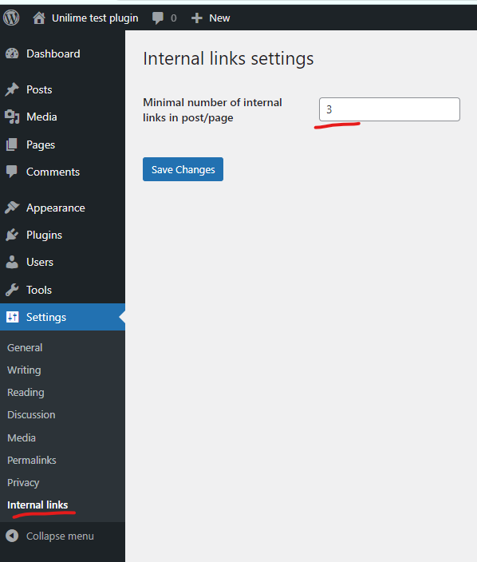
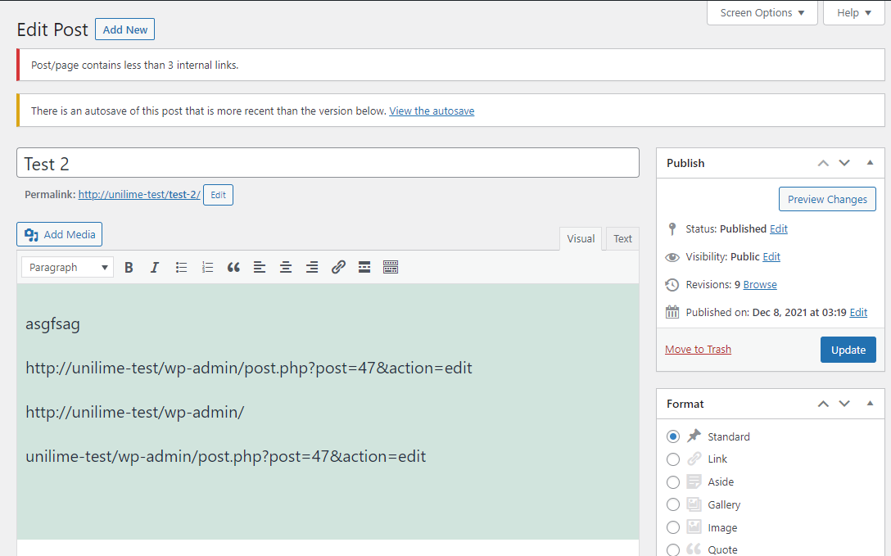
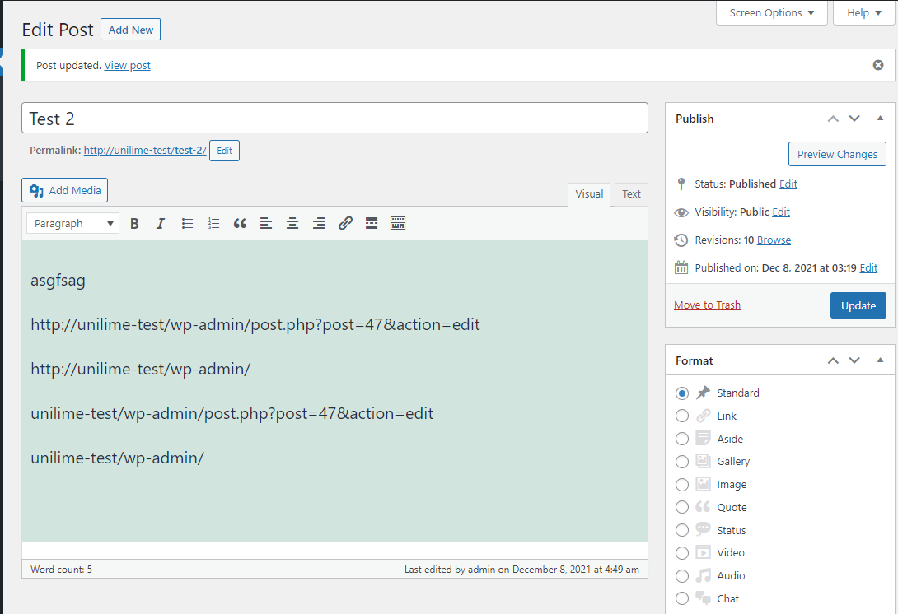

Plugin for test task (Unilime) bt Dmitry Alekseiev

Плагин не позволяет пользователю опубликовать или обновить пост(страницу) если кол-во внутренних ссылок в посте(странице) меньше, чем указано.
Чтобы указать кол-во минимальное кол-во внутренних ссылок необходимо зайти в Setting->Internal links

Если мы попытаемся обновить пост или создать с кол-вом внутренних ссылок, меньше чем заданное,(в нашем случае 3)

то будет показано предупреждение как показано на скриншоте, а пост сохранен не будет.

Если кол-во ссылок больше заданного, то пост будет успешно обновлен

